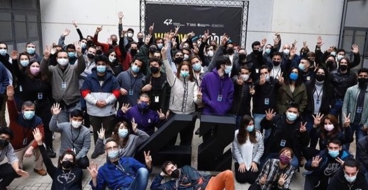

<!DOCTYPE html>
<html>
<head>
    <h1 align="center">Welcome to my GitHub profile.</h1>
</head>
<body>
    <h3>Abaut me:</h3>
    

        Mi name is Eloi, after more than 10 years in diferent work sectors, due to confinement, I discover my vocation in code and I decide to search a way to learn abaut it.💪  
        I needed a way to start my studies, combining them with mi work life, it is something complex when you work full time, and when I began to think that it was impossible, I found <a href="https://www.42barcelona.com/es/filosofia-42/" target="_blank" >42 Barcelona</a>.
    

    
    

        After a selection test of twenty-six days, in which skills such as tolerance to frustration, perseverance, proactivity and teamwork were tested through bash and "c" exercises based on the peer to peer methodology, I entered as an official campus student and started my career.
    

    <h3>Progress:</h3>
    
    

        Today, thanks to all my colleagues and all the tools provided by 42 Barcelona, ​​I can say that I am proud of everything I have learned, of what I continue to learn and of what I am sure I will learn about the code.
    

</body>
</html>